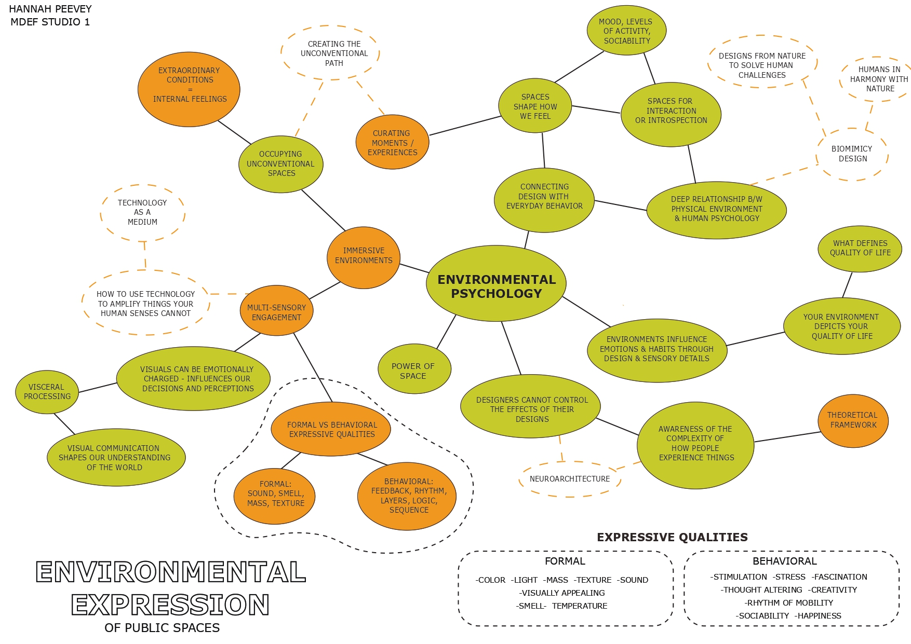
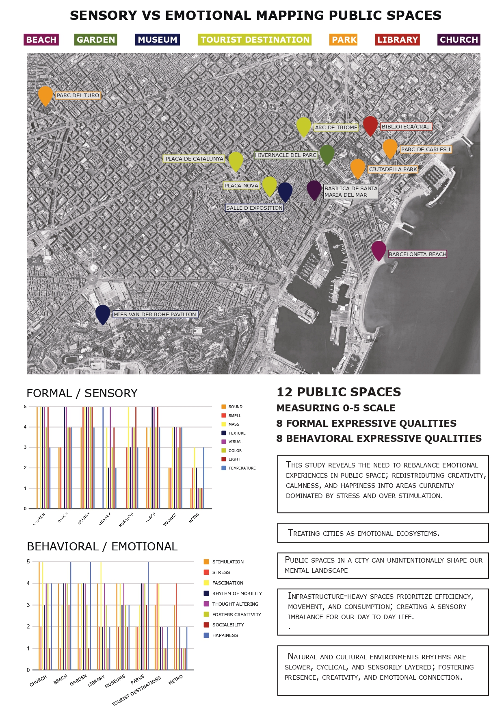
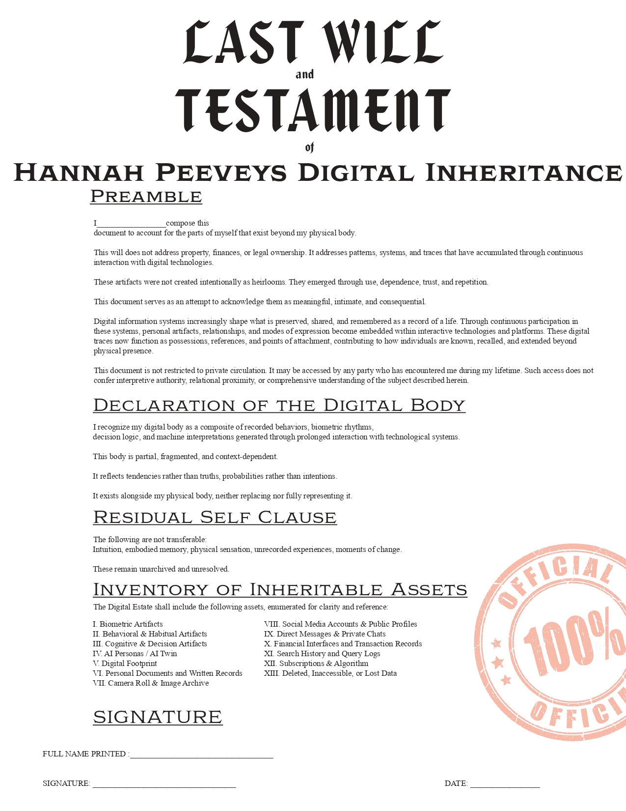

#  ★ ★ Design Studio ★ ★ 

  

## ★ Design Bet
**Enviromental Pscyhology**  
Sensory vs Emotional Mapping of Public Spaces around Barcelona

 
<iframe src="https://player.vimeo.com/video/1152010105?badge=0&amp;autopause=0&amp;player_id=0&amp;app_id=58479" frameborder="0" allow="autoplay; fullscreen; picture-in-picture; clipboard-write; encrypted-media; web-share" referrerpolicy="strict-origin-when-cross-origin" style="position:absolute;top:0;left:0;width:100%;height:100%;" title="HPeevey_Environmental Expression Video 2"></iframe>

  <!-- IMAGE 1 -->
  

    
  

  <!-- IMAGE 2 -->
  

    
  

---

## ★ Architecture of Action

**Idea:**  
Collected confessions from strangers were printed and scattered around Barcelona — reconnecting the digital and physical layers of data.

**Outcome:**  
A growing physical archive of digital intimacy.

---

## ★  Reflections 1: Architecture of Action
**Act 01:**  

<!-- Full-width Vimeo video 1 -->

  <iframe src="https://player.vimeo.com/video/1137736724?h=copy"
          style="position:absolute; top:0; left:0; width:100%; height:100%;"
          frameborder="0" allow="fullscreen; picture-in-picture"></iframe>

  Want to buy your friends data? click here to participate!

<!-- White box with black border BLINKING, text stays solid -->

<a href="https://hannahpeevey254.github.io/market-of-me/"
   style="color:#0066ff; font-size:20px; text-decoration:none; font-weight:600;">
   https://hannahpeevey254.github.io/market-of-me/
</a>

<!-- Full-width Vimeo video 2 -->

  <iframe src="https://player.vimeo.com/video/1137735178?h=copy"
          style="position:absolute; top:0; left:0; width:100%; height:100%;"
          frameborder="0" allow="fullscreen; picture-in-picture"></iframe>

---

## ★  Reflections 1: Collective Action
**Act 02:**  

WELCOME TO HANNAHS DIGITAL ECOSYSTEM

A collective built of 6 ai personas using different slices of my real, intimate data to become a society inside me

  

  

Click this link to interact with the 6 ai personas.

 Ask questions. Watch them debate. Have fun.

<!-- White box with black border BLINKING, text stays solid -->

<a href="https://hannahpeevey254.github.io/COLLECTIVE-HANNAH/"
   style="color:#0066ff; font-size:20px; text-decoration:none; font-weight:600;">
   https://hannahpeevey254.github.io/market-of-me/
</a>

  

Who the fck is Hannah?

---

## ★  Design Dialogues
 

Last Will and Testament of Hannah Peeveys Digital Inheritance

<!-- Horizontal split section -->

  <!-- LEFT IMAGE (fixed 40%) -->
 
  

    
  

  <!-- RIGHT TEXT (fixed 60%) -->
  

    

        I chose to create a will of my digital self as a way to formally acknowledge how much of a person’s life is now carried through data, systems, and digital artifacts rather than physical objects. As people share more information online and form deep attachments to digital data and artifacts, these virtual objects become deeply integrated into everyday life and, eventually, into how a life is remembered. This will treats those traces not as byproducts of technology use, but as meaningful records that shape identity, memory, and continuity beyond the physical body.
   
    

    

    The will acts as a container that brings together my broader body of work. The AI personas explore how identity fragments and persists through machine interpretation; the biometric stock market reframes bodily data as something that can be quantified, valued, and exchanged; and my research in environmental psychology examines how systems quietly influence behavior and decision-making. By organizing these elements into a legal-style document, the project asks what it means to take responsibility for one’s digital legacy. Rather than attempting to define a complete or truthful self, the will accepts the digital body as partial, contextual, and unresolved, and positions technological intimacy as the act of deciding what traces are allowed to remain, circulate, and outlive the individual.
    

    

  

