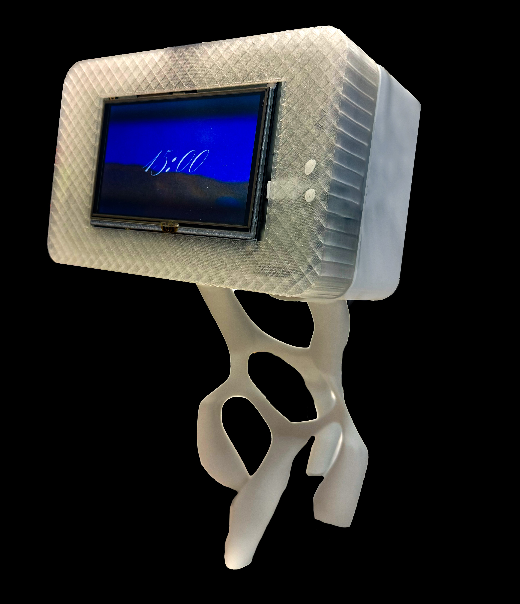
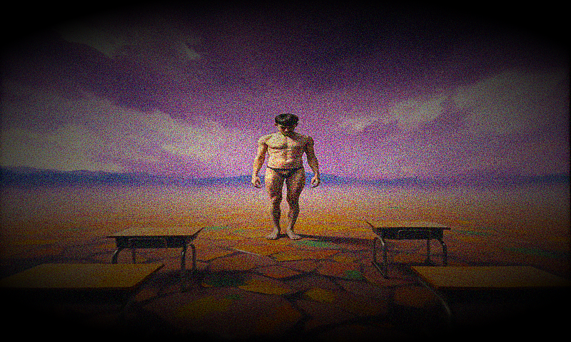
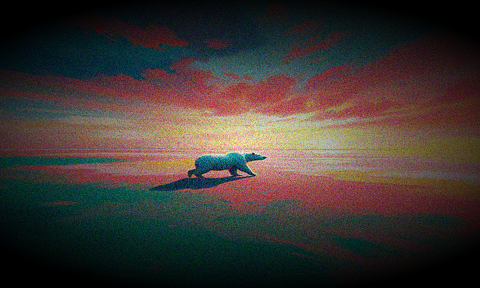
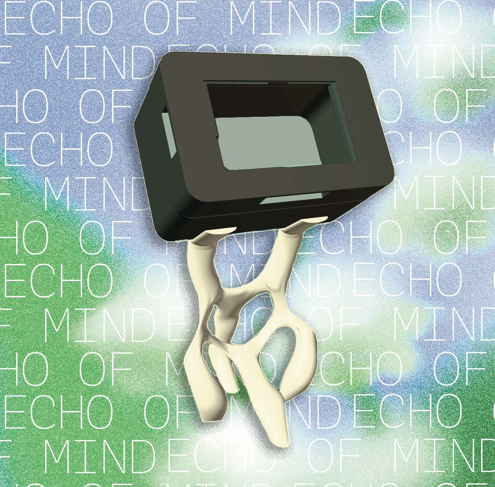
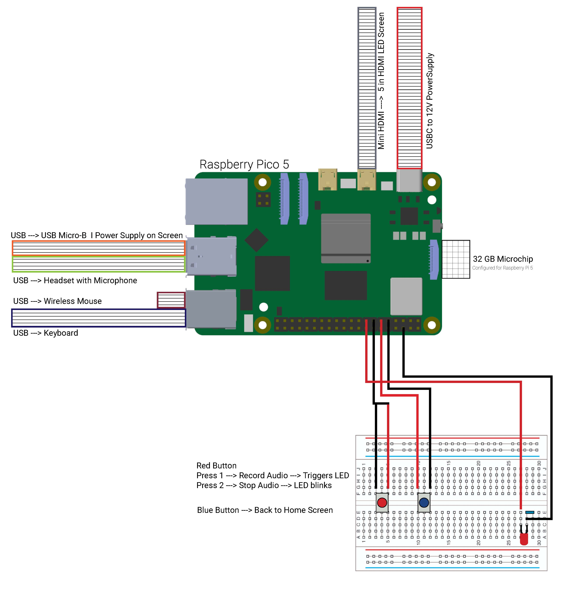

## ★  Cognitive Orgies II

<h2 style="margin-top:0; text-align:center;"> Echo of Mind.</h2>

  Echo of Mind began with a question about radical vulnerability.
  
  What happens when we make our most private mental states publicly visible? 
  
  Dreams occupy a unique position: they are deeply intimate, impossible to fake, and entirely beyond our conscious control.

    The project explores whether technology can act as a bridge between a ubconcious state and collective understanding — not through language, but through abstract visual form.

 

  <!-- LEFT SIDE TEXT -->
  

 <h4 style="margin-bottom:10px;">Process</h4>

 

      A person presses the blue button and speaks their dream into a microphone. 
      OpenAI Whisper transcribes the voice recording into text, which is passed to a custom 
      DreamWeaver GPT Agent. The agent interprets the dream across three psychoanalytic 
      dimensions — figurative, environmental, and emotional — and outputs a structured 
      Dream Signature as JSON.
  

  

      This signature becomes a visual prompt sent to FLUX.1-schnell via Hugging Face, 
      generating a unique painterly image. The image is post-processed at 800×480 with 
      grain and vignette, displayed on the Pi screen, and simultaneously pushed to a 
      public GitHub archive.
    

 <h4 style="margin-top:20px; margin-bottom:10px;">Outcome</h4>

 

      The Collective Archive — a live website hosted on GitHub Pages — fills up over time 
      as more people use the device. Each grid square represents one person's subconscious 
      state. The archive persists and grows, connecting strangers through their interior 
      lives in a way that language cannot.
    

 

      The system runs entirely on a Raspberry Pi 5 inside Docker, exposed publicly via a 
      Cloudflare Tunnel. The website polls GitHub every 10 seconds and automatically 
      places each new generated image into the next empty square on the grid.
    

  

  <!-- RIGHT SIDE IMAGE -->
  

    
  

----

<!-- ECHO OF MIND — SELF-CONTAINED SYSTEM DIAGRAM -->

  <!-- Title -->
  

    
System Architecture · Signal Flow

    

  

  <!-- CONTAINER -->
  

  <!-- Vertical spine -->
 

 <!-- ── 01 INPUT ── -->
  

      

      

        01 · Input
      

      

    

 <!-- Raspberry Pi node -->
  

      

        Raspberry Pi 5
        HARDWARE
      

    

<!-- Branches row -->
 

      <!-- Left -->
      

        

          USB Microphone
          

          

        

        

          Blue Button GPIO 17
          

          

        

        

          Red Button GPIO 27
          

          

        

      

      <!-- Right -->
      

        

          

          

          5" HDMI Display
        

        

          

          

          LED GPIO 22
        

        

          

          

          Docker + Flask
        

      

    

 <!-- ── 02 AI PIPELINE ── -->

      

      

        02 · AI Pipeline
      

      

    

<!-- Flow tag -->
 

      / Voice Input /
    

 <!-- Whisper node -->
 

      

        Whisper
        OPENAI
      

    

 <!-- Speech→Text branch -->
 

      

        

        

        Speech → Text
      

    

 <!-- DreamWeaver node -->
 

      

        DreamWeaver GPT Agent
        INTERPRETER
      

    

 <!-- DreamWeaver branches -->

      

        

          Figurative
          

          

        

        

          Environment
          

          

        

      

      

        

          

          

          Emotional
        

        

          

          

          Dream Signature JSON
        

      

    

 <!-- Flow tag -->
  

      / Visual Prompt /
    

 <!-- FLUX node -->
 

      

        FLUX.1-schnell
        HUGGING FACE
      

    

 <!-- FLUX branches -->
 

      

        Grain + Vignette
        

        

      

      

        

        

        Painterly 800×480px
      

    

 <!-- ── 03 OUTPUT ── -->
 

      

      

        03 · Output
      

      

    

 <!-- Funnel ovals -->
 

      
Pi Display — Live Pattern

      
SQLite Local Database

      
GitHub Push

      
Cloudflare Tunnel

    

<!-- ── 04 ARCHIVE ── -->

      

      

        04 · Archive
      

      

    

 <!-- Arrow -->
 

      

      

    

<!-- Collective Archive box -->

      
Collective Archive

    

 <!-- Archive branches -->
 

      

        GitHub Pages
        

        

      

      

        

        

        GitHub API (10s poll)
      

    

 <!-- Footer tagline -->
 

      
/ Human Connection Through a Subconscious State /

 

  

<!-- END DIAGRAM -->

---

<!-- IMAGE STRIP -->

  
Documented Dreams

  

    

    

    

    

    

  

  
Scroll to see more →

<!-- DEVICE DOCUMENTATION GRID -->

Documentation

  

  <!-- Bottom row — three equal photos -->
  

    

      
    

    

      
    

    

      
    

  

---

<h3 style="margin-top:0; text-align:center;"> Personal Reflection of Week 1.</h3>

<h3 style="margin-top:0; text-align:left;"> Cognitive Traces.</h3>

   The project began with a repository for a project called Dream Recorder from Modem Works. When we first discovered it, we assumed we had found something like a shortcut that would make the Cognitive Orgies course much easier. Instead of building the system from scratch, we thought we could simply adapt what already existed. That assumption changed quickly. It took us about two and a half days just to get the repository running, and the process forced us through a steep learning curve. At several points I questioned whether it would actually be faster to rebuild the system ourselves rather than continue troubleshooting the repo.

What initially looked like a shortcut ended up shifting how we approached the project and our relationship with the tools we were using. Rather than functioning as a cheat code, the repository became a learning environment where we had to understand how different systems were connected and how to adapt them. In the end, we decided to document our process and publish the repository on GitHub so that future designers can learn from what worked, what broke, and how the system evolved through trial and error.

 

---

<h3 style="margin-top:0; text-align:left;"> Moral Traces.</h3>

   Over the four days of the course, everyone gradually leaned into the areas where they felt most comfortable and contributed those strengths to the project. In my case, I focused on the concept development, drawings, building the AI agents, and creating the collective archive website. The first few days were challenging in terms of collaboration because the repository initially lived on a single computer and required downloading, configuring, and adapting across machines. During that time I worked independently on the archive website and the AI agents while the rest of the team focused on stabilizing the technical setup.

To guide the AI system, we created a kind of specification sheet that described the user intentions, integrations, and aesthetic direction we wanted the agent to follow. This helped us shape the behavior of the system and allowed the AI component to align more closely with the conceptual direction of the project.

 

---

<h3 style="margin-top:0; text-align:left;"> Technical Process Traces.</h3>

  The repository originally outlined a specific set of tools and components that were supposed to be used to run the system. As we began assembling the project, we quickly realized that some of the required hardware and software were not available to us. Missing cables, microphones, screens, and other equipment meant that the system could not simply be reproduced as written. We had to continuously adapt the setup and find alternatives using the materials and technologies we had access to.

At the time this felt frustrating because it slowed the process and forced us to deviate from the original instructions. Looking back, those constraints actually shaped the project in important ways. They pushed us to improvise, rethink certain technical decisions, and ultimately customize the system in a way that made the final result more aligned with the experience we wanted to create.

 

---

 

 

  Explore the Collective Arhive of Echo of Mind

<!-- White box with black border BLINKING, text stays solid -->

<a href="https://hannahpeevey254.github.io/ECHO-OF-MIND/"
   style="color:#0066ff; font-size:20px; text-decoration:none; font-weight:600;">
   https://hannahpeevey254.github.io/ECHO-OF-MIND/
</a>

