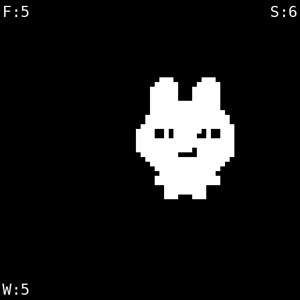
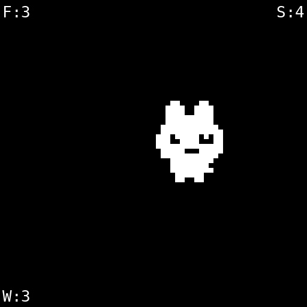
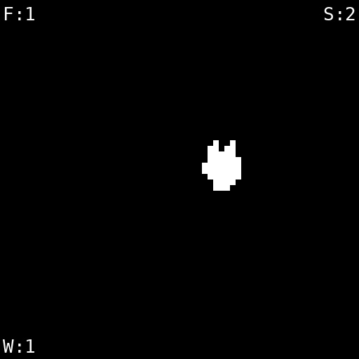
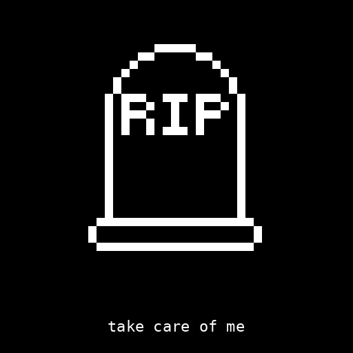

## ★  Cognitive Orgies II

<h2 style="margin-top:0; text-align:center;"> MOCHI.</h2>

  Mochi is a self-contained cyberdeck companion — no cloud, no app store, no extraction. 
  
  You feed it data through physical buttons: sleep, water, food. 
  
  It responds with its body. Tend to it and it grows. Neglect it and it shrinks. Abandon it and it dies. It is not a wellness tracker. It is not a fitness app. It is a mirror with a body
  
   a physical object that makes the invisible exchange between you and your data visible, chosen, and consequential.

 

  <!-- LEFT SIDE TEXT -->
  

 <h4 style="margin-bottom:10px;">Process</h4>

 

      Built entirely through iterative vibe coding — no prior hardware experience, no existing template, no blueprint to follow. Starting from a concept and a components list, I programmed the full firmware from scratch: the sensor logic, the button inputs, the mood states, the shrink and grow animations, and the death mechanic. Every behaviour Mochi has was written, tested, broken, and rewritten. The stack was assembled deliberately.
  

  

       ESP32 as the brain — cheap, powerful, offline by design. Physical buttons as the only interface — no touchscreen, no scroll, no infinite feed. Just three inputs: sleep, water, food. The companion Expo app exists as an optional mirror, not a requirement. Mochi works without your phone. That was a non-negotiable design decision. The entire codebase is open source on GitHub — the schematic, the firmware, the death logic, all of it. Making it open wasn't an afterthought. It is part of the argument.
    

 <h4 style="margin-top:20px; margin-bottom:10px;">Outcome</h4>

 

      Mochi is the first act of a trilogy about what happens to your data self. Here, you choose to tend it. In Data Body, it gets extracted and traded. In Safe Hands, it outlives you. Together they trace the full arc of personal data — from body, to commodity, to ghost. 
    

 

      Mochi asks the earliest question: what if the act of logging yourself was a practice of care, not a product to be sold?
    

  

  <!-- RIGHT SIDE IMAGE -->
  

  

----
<!-- MOCHI PET — SELF-CONTAINED SYSTEM DIAGRAM -->

  <!-- Title -->
  

    
System Architecture · Signal Flow

    

  

  <!-- CONTAINER -->
  

  <!-- Vertical spine -->
  

  <!-- ── 01 HARDWARE ── -->
  

    

    

      01 · Hardware
    

    

  

  <!-- ESP32-S3 node -->
  

    

      ESP32-S3 WROOM-1
      MICROCONTROLLER
    

  

  <!-- Hardware branches -->
  

    <!-- Left -->
    

      

        Feed btn GPIO 15
        

        

      

      

        Water btn GPIO 17
        

        

      

      

        Sleep btn GPIO 16
        

        

      

    

    <!-- Right -->
    

      

        

        

        Grove OLED 128×128
      

      

        

        

        I²C 0x3C · SH1107
      

      

        

        

        NVS (Preferences)
      

    

  

  <!-- ── 02 FIRMWARE ── -->
  

    

    

      02 · Firmware
    

    

  

  <!-- Flow tag -->
  

    / boot /
  

  <!-- Loading screen node -->
  

    

      Loading Screen
      HEART RINGS
    

  

  <!-- Loading screen branches -->
  

    

      Concentric hearts
      

      

    

    

      

      

      "hi im mochi"
    

  

  <!-- Flow tag -->
  

    / main loop ~60fps /
  

  <!-- Stat engine node -->
  

    

      Stat Engine
      LOOP ~60FPS
    

  

  <!-- Stat engine branches -->
  

    

      

        Decay (10s interval)
        

        

      

      

        Food / Water / Sleep
        

        

      

    

    

      

        

        

        Weighted avg score
      

      

        

        

        Death if any stat = 0
      

    

  

  <!-- ── 03 SPRITES ── -->
  

    

    

      03 · Sprites
    

    

  

  <!-- Flow tag -->
  

    / sprites.h · PROGMEM /
  

  <!-- Renderer node -->
  

    

      Pixel Art Renderer
      U8G2 · MSB-FIRST
    

  

  <!-- Sprite branches -->
  

    

      

        Size 4 · 28×34px · thriving
        

        

      

      

        Size 3 · 21×26px · okay
        

        

      

      

        Size 2 · 14×17px · neglected
        

        

      

    

    

      

        

        

        Size 1 · 7×9px · critical
      

      

        

        

        Grave · 21×25px · dead
      

      

        

        

        Sine bounce animation
      

    

  

  <!-- ── 04 OUTPUT ── -->
  

    

    

      04 · Output
    

    

  

  <!-- Funnel ovals -->
  

    
OLED display · 128×128px

    
Corner stat overlay (F / S / W)

    
Death screen · gravestone

    
NVS autosave · 60s

  

  <!-- Footer tagline -->
  

    
/ take care of me /

  

  

<!-- END DIAGRAM -->
---

<!-- IMAGE STRIP -->

  
Mochi Screen Display

  

    

    

    

    

    

    

  

  
Scroll to see more →

<!-- DEVICE DOCUMENTATION GRID -->

Documentation

  

  <!-- Bottom row — three equal photos -->
  

    

      
    

    

      
    

    

      
    

  

---

<h3 style="margin-top:0; text-align:center;"> Personal Reflection of Week 1.</h3>

<h3 style="margin-top:0; text-align:left;"> Cognitive Traces.</h3>

   Originally we tried using an open source Tamagotchi I found online, but after our previous experience in cognitive orgies struggling with a similar approach, I made the decision to build from scratch instead. That experience taught me something important: using open source code is genuinely difficult to modify and adapt to your needs. It is almost always more effective to use an existing project as inspiration and reference, but to build your own implementation from the ground up.

 

---

<h3 style="margin-top:0; text-align:left;"> Moral Traces.</h3>

   The group had a really healthy dynamic where everyone worked in areas they genuinely wanted to grow in, while still contributing to a shared project. I focused on building Mochi from scratch and designing it as open source so the other group members could make their own versions and adapt it to whatever screen size they needed. We supported each other in moments of needing help or making stylistic choices, but maintained a real respect for each person to develop their own work independently. It was a very positive group dynamic overall.

 

---

<h3 style="margin-top:0; text-align:left;"> Technical Process Traces.</h3>

  One of the more difficult design challenges was figuring out how to physically fit the Arduino, buttons, and power source into a device we wanted to keep small and compact. To solve this, I designed a star shaped enclosure that functions as a carabiner and acts as an open container to hold all the components together. In the end it turned out considerably larger than intended, but it was a deliberate design decision. Looking back, in future prototyping rounds I would revisit that solution and find a more compact alternative.

 

---

 

 

  Build your own MOCHI

<!-- White box with black border BLINKING, text stays solid -->

<a href="https://github.com/hannahpeevey254/MOCHI-PET"
   style="color:#0066ff; font-size:20px; text-decoration:none; font-weight:600;">
   https://github.com/hannahpeevey254/MOCHI-PET
</a>

